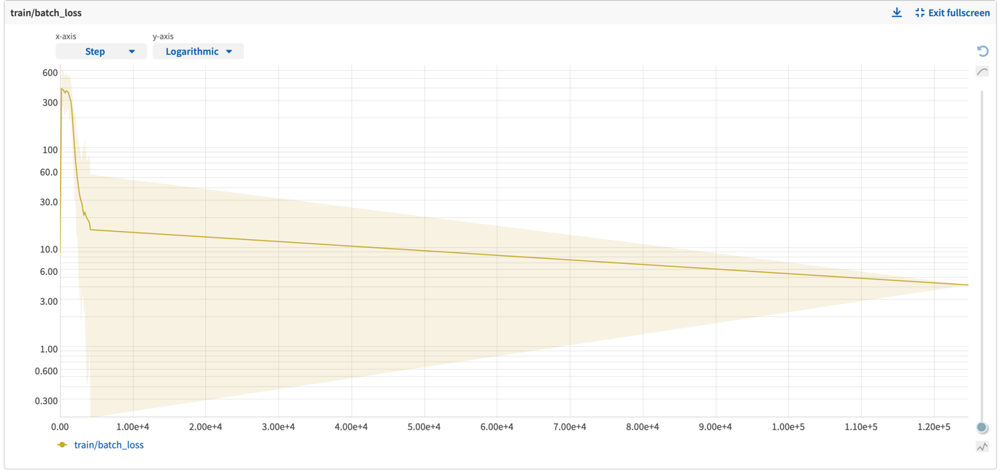
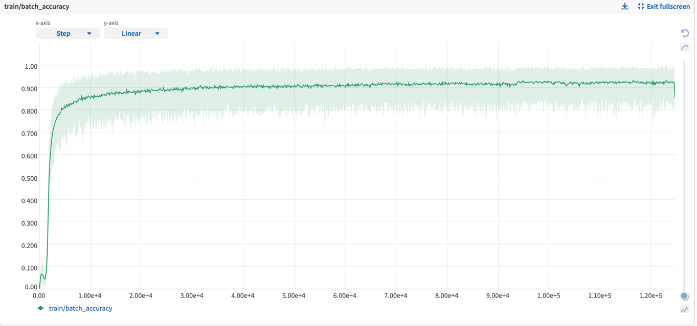

# Deep-TextSpotter PyTorch
PyTorch implementation Deep TextSpotter [paper.](https://openaccess.thecvf.com/content_ICCV_2017/papers/Busta_Deep_TextSpotter_An_ICCV_2017_paper.pdf)

## Model training:

1)Train on first 1 million images from MjSynth ([link](https://www.robots.ox.ac.uk/~vgg/data/text/)).
2)Evaluation on first 100k test set images  

## Model results:

1.Train batch loss:

2.Train batch accuracy:

3.Val accuracy:

